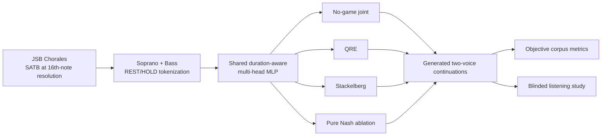

# Game-Theoretic Two-Voice Music Generation

Research code for studying whether **game-theoretic inference** can improve symbolic two-voice coordination beyond a strong learned joint-compatibility baseline.

The project uses soprano and bass voices from the JSB Chorales and compares a shared neural utility model under several inference-time decision rules: **No-game joint**, **Quantal Response Equilibrium (QRE)**, **Stackelberg**, and a **pure Nash equilibrium ablation**.

> **Main finding:** game-theoretic decision rules measurably change generation behavior, but their benefits are selective rather than uniformly better. Stackelberg inference improves local 3-gram diversity matching, while the learned No-game joint baseline remains very strong on vertical coordination and is preferred for perceived coherence in the listening study.

## Research question

> Does a game-theoretic pair-selection rule provide additional coordination benefits beyond learned joint compatibility when the predictive model, state representation, candidate set, test pieces, and continuation length are held fixed?

## Method overview



The neural model predicts upper-voice logits, lower-voice logits, and joint pair-compatibility logits. In the final controlled comparison, **all inference methods use the same duration-aware checkpoint and candidate grid; only the pair-selection rule changes**.

## Inference methods

| Method | Role in the study |
|---|---|
| **No-game joint** | Strong learned pair-compatibility baseline without an explicit game solver |
| **QRE** | Simultaneous iterative soft-response game with compatibility filtering |
| **Lower Stackelberg** | Bass/lower voice leads; upper voice soft-responds |
| **Upper Stackelberg** | Soprano/upper voice leads; lower voice soft-responds |
| **Pure Nash** | Strategic-stability ablation using pure equilibria with deterministic fallback |

Validation-selected settings are available in [`configs/final_inference.yaml`](configs/final_inference.yaml).

## Final evaluation

The authoritative objective test uses **all 77 held-out test chorales**, with one matched 128-step continuation per chorale and method. The 16-step real seed prefix is removed before evaluation. Cross-chorale uncertainty is estimated with **10,000 paired percentile-bootstrap resamples**.

Selected corpus-similarity results (lower is better):

| Metric | No-game | QRE | Lower STK | Upper STK | Nash |
|---|---:|---:|---:|---:|---:|
| Harmonic interval-class JS | **0.0073** | 0.0288 | 0.0124 | 0.0075 | 0.0847 |
| Voice-distance JS | **0.0094** | 0.0332 | 0.0143 | 0.0099 | 0.1009 |
| Unique 3-gram ratio gap | 0.1170 | 0.1676 | 0.0813 | **0.0777** | 0.4868 |
| Hold-ratio gap | 0.0148 | **0.0103** | 0.0344 | 0.0318 | 0.2107 |

### Bootstrap-supported findings

Relative to No-game joint:

- **Lower Stackelberg** improves the unique 3-gram ratio gap: Δ = **-0.0357**, 95% CI **[-0.0563, -0.0153]**.
- **Upper Stackelberg** also improves it: Δ = **-0.0393**, 95% CI **[-0.0616, -0.0168]**.
- Upper Stackelberg is very close to No-game joint on harmonic interval-class JS and voice-distance JS, but the paired confidence intervals cross zero; this is **not** claimed as statistical equivalence.
- QRE has lower point estimates for hold-ratio gap and both melodic-interval JS metrics, but those apparent advantages over No-game joint are not reliably directional under the paired bootstrap.
- Pure Nash collapses toward excessive sustain and very low local diversity: hold ratio **0.9669** vs **0.7562** in real test music, and unique 3-gram ratio **0.0830** vs **0.5698** in real music.

Full result tables are in [`results/`](results/).

## Listening study

A blinded A/B study with **47 participants** compared validation-selected No-game joint, QRE, and lower-leader Stackelberg outputs. Each participant evaluated coordination, musical coherence, and overall preference.

After Holm correction across all 9 participant-level tests, only **No-game joint vs Lower Stackelberg on perceived coherence** remained below 0.05 (raw p = 0.0033), favoring No-game joint.

This creates an informative objective/perceptual contrast: **Lower Stackelberg reliably improves local 3-gram diversity matching, but that improvement does not translate into better perceived coherence.**

See [`docs/listening_study.md`](docs/listening_study.md) for the protocol and [`results/listening_study_summary.csv`](results/listening_study_summary.csv) for the compact result table.

## Repository structure

```text
.
├── configs/                 # training and final inference settings
├── data/                    # local raw/processed data placeholders
├── docs/                    # experimental and reproducibility details
├── results/                 # compact final result tables
├── scripts/                 # preprocessing, training, generation, evaluation
├── src/two_voice_game/      # model, features, solvers, generation, metrics
├── tests/                   # small solver/state unit tests
├── requirements.txt
└── README.md
```

## Setup

Python **3.10+** is recommended.

```bash
python -m venv .venv
# Windows: .venv\Scripts\activate
# macOS/Linux: source .venv/bin/activate
pip install -r requirements.txt
```

For the included unit tests:

```bash
pip install -r requirements-dev.txt
pytest -q
```

## Data preparation

The dataset itself is intentionally not redistributed here. Download `Jsb16thSeparated.json` from the public [JSB-Chorales-dataset repository](https://github.com/czhuang/JSB-Chorales-dataset) and place it at:

```text
data/raw/Jsb16thSeparated.json
```

Then run:

```bash
python scripts/preprocess_data.py
```

The preprocessing stage extracts soprano and bass and creates `HOLD=-2` tokens for consecutive repeated non-rest pitches. The expected standard split contains 229 training, 76 validation, and 77 test chorales.

## Train the duration-aware utility model

```bash
python scripts/train_multihead_mlp.py \
  --config configs/train_ctx16_duration_aware.yaml
```

The best checkpoint is written to:

```text
checkpoints/utility_ctx16_duration_aware/best.pt
```

## Generate music

Example No-game joint baseline:

```bash
python scripts/generate_music.py \
  --checkpoint checkpoints/utility_ctx16_duration_aware/best.pt \
  --split test \
  --method no_game_joint \
  --num_seeds 10 \
  --steps 128 \
  --top_k 12 \
  --run_name no_game_demo
```

Example QRE configuration used in the final study:

```bash
python scripts/generate_music.py \
  --checkpoint checkpoints/utility_ctx16_duration_aware/best.pt \
  --split test \
  --method qre_game \
  --num_seeds 10 \
  --steps 128 \
  --top_k 12 \
  --alpha 0.5 \
  --beta_private 0.5 \
  --qre_beta 0.5 \
  --qre_iterations 20 \
  --compat_top_pairs 20 \
  --run_name qre_demo
```

Stackelberg and Nash arguments are documented by:

```bash
python scripts/generate_music.py --help
```

## Evaluate generated runs

```bash
python scripts/evaluate_generation.py \
  --data data/processed/jsb_two_voice_tokens.npz \
  --real_split test \
  --run_dirs \
    no_game_joint=outputs/generated/<no_game_run> \
    qre=outputs/generated/<qre_run> \
  --eval_name comparison
```

For a full matched final comparison, generate the same test pieces for each method, then use `scripts/bootstrap_final_test.py` to compute paired confidence intervals.

## Design notes

- The final model state is **duration-aware**, but duration features are computed only from the fixed visible context window to keep training and generation aligned.
- Hyperparameters for the reported game methods were selected on validation data before the final held-out test.
- A confidence interval crossing zero is not interpreted as evidence of equivalence.
- Pure Nash is included as an informative strategic ablation, not as the recommended generator.

More detail: [`docs/experiment_details.md`](docs/experiment_details.md) and [`docs/reproducibility.md`](docs/reproducibility.md).

## Dataset reference

The repository uses the standard JSB Chorales train/validation/test split distributed in the public `JSB-Chorales-dataset` repository, which traces the split to:

> Boulanger-Lewandowski, N., Vincent, P., & Bengio, Y. (2012). *Modeling Temporal Dependencies in High-Dimensional Sequences: Application to Polyphonic Music Generation and Transcription*. ICML.

## License

The code in this repository is released under the [MIT License](LICENSE). Third-party datasets remain subject to their own terms and are not redistributed here.
