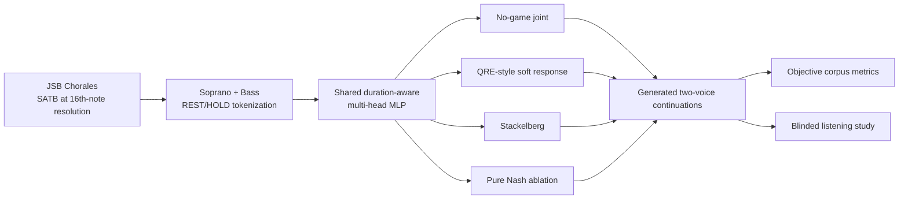
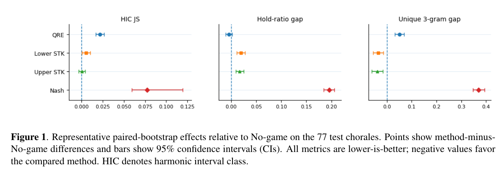

# Do Game-Theoretic Decision Rules Improve Two-Voice Music Generation?

**Po-Chen Liu** · **Hsiang-Yen Fan**  
National Tsing Hua University, Taiwan

**Status:** Submitted to **ISMIR Late-Breaking/Demo (LBD), 2026**  
**Paper:** [ISMIR LBD manuscript](docs/papers/ismir_lbd_2026_submission.pdf) · [Extended technical report](docs/papers/extended_technical_report.pdf)

Research code and experimental artifacts for a controlled study of whether **game-theoretic inference-time decision rules** improve symbolic two-voice music generation beyond a strong learned joint-compatibility baseline.

The project uses soprano and bass voices from the JSB Chorales. A shared duration-aware neural utility model is held fixed while the inference rule is changed among **No-game joint sampling**, **compatibility-filtered QRE-style soft response**, **Stackelberg leader-follower selection**, and a **pure Nash-equilibrium ablation**.

> **Main finding:** strategic inference changes generation behavior in repeatable, method-specific ways, but stronger strategic structure is not uniformly better. Stackelberg improves local 3-gram diversity matching, while the learned No-game joint baseline remains strong on vertical coordination and is preferred for perceived coherence in the listening study.

## Research question

> Does a game-theoretic decision rule improve two-voice generation beyond a no-game learned joint-compatibility baseline under the same model, state representation, candidate set, seeds, and continuation length?

## Method overview



The model predicts upper-voice private scores, lower-voice private scores, and a learned pair-compatibility score. At each generation step, all interacting methods use the same top-12-by-top-12 candidate grid. The final controlled comparison keeps the duration-aware checkpoint and candidate construction fixed and changes the inference-time pair-selection rule.

## Inference methods

| Method | Role in the study |
|---|---|
| **No-game joint** | Strong learned pair-compatibility baseline without an explicit game solver |
| **QRE-style** | Iterative simultaneous soft-response approximation, filtered to high-compatibility candidate pairs |
| **Lower Stackelberg** | Bass/lower voice leads; upper voice soft-responds |
| **Upper Stackelberg** | Soprano/upper voice leads; lower voice soft-responds; included as a leader ablation |
| **Pure Nash** | Strict local-equilibrium ablation with welfare tie-breaking/fallback |

The QRE implementation is deliberately described as **QRE-style**: it uses iterative logit soft responses rather than claiming an exact analytical QRE solution.

Validation-selected settings are stored in [`configs/final_inference.yaml`](configs/final_inference.yaml).

## Final objective evaluation

The authoritative objective test uses **all 77 held-out test chorales**. Every method receives the same 16-step real prefix and generates a matched 128-step continuation; the seed prefix is removed before scoring. Cross-chorale uncertainty is estimated with **10,000 paired percentile-bootstrap resamples**.

Selected corpus-similarity results (lower is better):

| Metric | No-game | QRE | Lower STK | Upper STK | Nash |
|---|---:|---:|---:|---:|---:|
| Harmonic interval-class JS | **0.0073** | 0.0288 | 0.0124 | 0.0075 | 0.0847 |
| Voice-distance JS | **0.0094** | 0.0332 | 0.0143 | 0.0099 | 0.1009 |
| Unique 3-gram ratio gap | 0.1170 | 0.1676 | 0.0813 | **0.0777** | 0.4868 |
| Hold-ratio gap | 0.0148 | **0.0103** | 0.0344 | 0.0318 | 0.2107 |

### Bootstrap-supported findings

Relative to No-game joint:

- **Lower Stackelberg** improves the unique 3-gram ratio gap: Δ = **-0.0357**, 95% CI **[-0.0563, -0.0153]**.
- **Upper Stackelberg** also improves it: Δ = **-0.0393**, 95% CI **[-0.0616, -0.0168]**.
- Upper Stackelberg stays close to No-game joint on harmonic interval-class and voice-distance JS, but the paired confidence intervals cross zero; this is **not** interpreted as statistical equivalence.
- QRE has lower point estimates for hold-ratio gap and both melodic-interval JS metrics, but those apparent advantages over No-game joint are not reliably directional under paired bootstrap.
- Pure Nash collapses toward excessive sustain and very low local diversity: hold ratio **0.9669** vs **0.7562** in real test music, and unique 3-gram ratio **0.0830** vs **0.5698** in real music.



*Representative paired-bootstrap effects from the ISMIR LBD manuscript. Negative differences favor the compared method because all three plotted metrics are lower-is-better.*

Full compact result tables are available in [`results/`](results/).

## Listening study

A blinded A/B listening study used an online convenience sample of **47 participants**. Three method pairings were evaluated with four matched seeds each, giving **12 A/B trials** per participant. Each clip contained an 8-bar generated continuation (about 21.3 s at 90 BPM) rendered with the same piano timbre and presented without method-identifying visual cues.

Participants judged:

1. coordination between upper and lower voices,
2. naturalness/coherence, and
3. overall preference.

Responses were aggregated at the participant level before two-sided exact binomial tests, with **Holm correction across nine tests**.

The clearest perceptual result was **No-game joint vs Lower Stackelberg on perceived coherence**: 24 participants favored No-game, 7 favored Lower Stackelberg, and 16 were tied at the participant level. This was the only comparison that remained below 0.05 after Holm correction.

The objective/perceptual contrast is central to the study: **Lower Stackelberg reliably improves local 3-gram diversity matching, but that improvement does not translate into better perceived coherence.**

See [`docs/listening_study.md`](docs/listening_study.md) and [`results/listening_study_summary.csv`](results/listening_study_summary.csv).

## Experimental caveat

The strategic methods were selected from different validation search spaces: **QRE from 9 settings, Stackelberg from 6, and Nash from 3**, whereas No-game joint was not swept. The final test is still held out and all selected settings are frozen before testing, but this tuning asymmetry means that not every performance difference can be attributed solely to the decision-rule family.

## Papers and documentation

- [ISMIR LBD 2026 submission (3 pages)](docs/papers/ismir_lbd_2026_submission.pdf) - compact paper containing the final framing, evaluation, and main figure.
- [Extended technical report (10 pages)](docs/papers/extended_technical_report.pdf) - full method, validation, final-test, listening-study, discussion, and limitations.
- [Experimental design notes](docs/experiment_details.md)
- [Listening-study details](docs/listening_study.md)
- [Reproducibility notes](docs/reproducibility.md)

## Repository structure

```text
.
├── assets/                  # README figures
├── configs/                 # training and final inference settings
├── data/                    # local raw/processed data placeholders
├── docs/
│   ├── papers/              # ISMIR manuscript and extended report
│   └── ...                  # experiment/listening/reproducibility notes
├── results/                 # compact final result tables
├── scripts/                 # preprocessing, training, generation, evaluation
├── src/two_voice_game/      # model, features, solvers, generation, metrics
├── tests/                   # solver/state unit tests
├── requirements.txt
└── README.md
```

## Setup

Python **3.10+** is recommended.

```bash
python -m venv .venv
# Windows: .venv\Scripts\activate
# macOS/Linux: source .venv/bin/activate
pip install -r requirements.txt
```

For the included unit tests:

```bash
pip install -r requirements-dev.txt
pytest -q
```

## Data preparation

The dataset itself is intentionally not redistributed. Download `Jsb16thSeparated.json` from the public [JSB-Chorales-dataset repository](https://github.com/czhuang/JSB-Chorales-dataset) and place it at:

```text
data/raw/Jsb16thSeparated.json
```

Then run:

```bash
python scripts/preprocess_data.py
```

Preprocessing extracts soprano and bass and creates `HOLD=-2` tokens for consecutive repeated non-rest pitches. The expected standard split contains 229 training, 76 validation, and 77 test chorales.

## Train the duration-aware utility model

```bash
python scripts/train_multihead_mlp.py \
  --config configs/train_ctx16_duration_aware.yaml
```

The best checkpoint is written to:

```text
checkpoints/utility_ctx16_duration_aware/best.pt
```

## Generate music

Example No-game joint baseline:

```bash
python scripts/generate_music.py \
  --checkpoint checkpoints/utility_ctx16_duration_aware/best.pt \
  --split test \
  --method no_game_joint \
  --num_seeds 10 \
  --steps 128 \
  --top_k 12 \
  --run_name no_game_demo
```

Example QRE-style configuration used in the final study:

```bash
python scripts/generate_music.py \
  --checkpoint checkpoints/utility_ctx16_duration_aware/best.pt \
  --split test \
  --method qre_game \
  --num_seeds 10 \
  --steps 128 \
  --top_k 12 \
  --alpha 0.5 \
  --beta_private 0.5 \
  --qre_beta 0.5 \
  --qre_iterations 20 \
  --compat_top_pairs 20 \
  --run_name qre_demo
```

Stackelberg and Nash arguments are documented by:

```bash
python scripts/generate_music.py --help
```

## Evaluate generated runs

```bash
python scripts/evaluate_generation.py \
  --data data/processed/jsb_two_voice_tokens.npz \
  --real_split test \
  --run_dirs \
    no_game_joint=outputs/generated/<no_game_run> \
    qre=outputs/generated/<qre_run> \
  --eval_name comparison
```

For the matched final comparison, generate the same held-out test pieces for every method and use `scripts/bootstrap_final_test.py` to compute paired confidence intervals.

## Reproducibility and design notes

- The final model state is **duration-aware**, with six explicit duration features in addition to the 16-step two-voice context and bar position.
- All final inference methods use the same duration-aware checkpoint and candidate construction.
- Hyperparameters for the reported strategic methods are selected on validation data and frozen before the held-out final test.
- A paired confidence interval crossing zero is treated as an uncertain directional difference, not as evidence of equivalence.
- Pure Nash is included as an informative strict-equilibrium ablation, not as the recommended generator.

More detail: [`docs/experiment_details.md`](docs/experiment_details.md) and [`docs/reproducibility.md`](docs/reproducibility.md).

## Limitations

- The utility model is a relatively small MLP and does not explicitly model key, phrase structure, tonal function, or long-range form.
- The game is solved myopically at each timestep; there is no lookahead over future musical consequences.
- The final objective bootstrap quantifies uncertainty across 77 held-out chorales, but not model-training uncertainty or repeated stochastic generations within each chorale.
- The listening study uses a 47-participant online convenience sample rather than a probability-based or expertise-stratified panel.
- Listening stimuli contain 8-bar continuations, so the study does not evaluate long-form musical coherence.

The findings should therefore be read as evidence about inference-time decision rules **under this fixed model, dataset, and continuation length**, rather than as a universal ranking of game-theoretic music generators.

## Dataset reference

The repository uses the standard JSB Chorales train/validation/test split distributed in the public `JSB-Chorales-dataset` repository, which traces the split to:

> Boulanger-Lewandowski, N., Vincent, P., & Bengio, Y. (2012). *Modeling Temporal Dependencies in High-Dimensional Sequences: Application to Polyphonic Music Generation and Transcription*. ICML.

## Citation

Until a proceedings citation is available, please cite the submitted manuscript as:

```bibtex
@misc{liu2026gametheoretic,
  title  = {Do Game-Theoretic Decision Rules Improve Two-Voice Music Generation?},
  author = {Liu, Po-Chen and Fan, Hsiang-Yen},
  year   = {2026},
  note   = {Submitted to ISMIR Late-Breaking/Demo (LBD)}
}
```

## License

The code in this repository is released under the [MIT License](LICENSE). Third-party datasets remain subject to their own terms and are not redistributed here. The 3-page ISMIR manuscript contains its own CC BY 4.0 notice.
